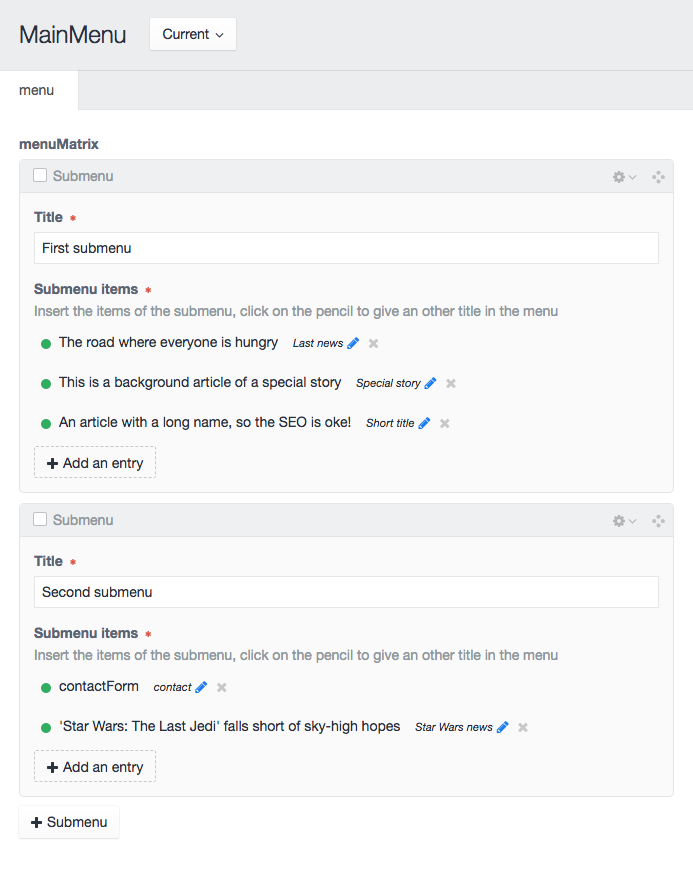

# Title Entries Field plugin for Craft CMS 3.x

Craft plugin that provides a new field type that works like an Entries field type but offers users an easy way to set a different title for the relation than the related page title.

This is particularly useful if you are linking to other content but want to use shorter or different titles in the lists e.g. in menus, submenus or related lists.

## Installation

To install the Title Entries Field type, follow these steps:

1. Install with Composer via `composer require dolphiq/titleentriesfield` from your project folder
2. Install plugin in the Craft Control Panel under Settings > Plugins
3. The `Title Entries Field` type will be available when adding a new field - Settings > Fields > Add new field

Title Entries Field plugin works on Craft 3.x.

### Example of the Title Entries Field in action


## Using the Title Entries Field

You can use the field as a normal Entries field type but give the end user the possibility to change te label for each relation/link.

### Usage sample in Twig templates
```

  {{ entry.title }} - {{ entry.linkTitle }} <br>

```

### Usage sample to display the Title Entries Field if the field is set or use the title field as backup (entry.Title)
```
<ul>

  <li><a href="{{ entry.url }}" rel="{{ entry.title }}">
    {{ entry.Title }}
  </a>

</ul>
```

### Contributors & Developers
Johan Zandstra - info@dolphiq.nl
Brought to you by [Dolphiq](https://dolphiq.nl)
